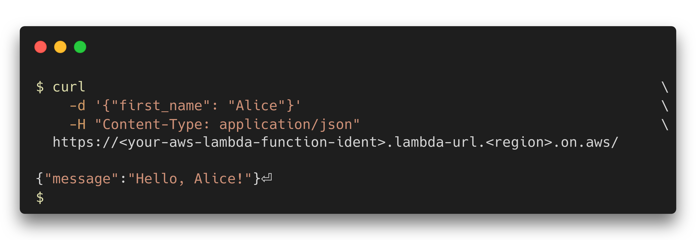

# GaaS

**Greeting-as-a-service** (GaaS) implements a Rust 🦀 AWS Lambda Server Function that greets the user.

## Features
- Friendly errors for invalid data
- High performance, meaning low costs
- Convention over configuration
- Easy set-up for existing AWS users

## Set-up

### Dependencies
- An AWS account with sufficient privileges
- [Cargo Lambda](https://www.cargo-lambda.info/guide/installation.html)
- [Rust](https://rustup.rs/)

### Instructions
1. Clone the project
2. Compile it with `cargo lambda build --release -o zip`
3. Create a new Lambda Function in the [AWS Console](https://console.aws.amazon.com/lambda/home#/create/function)
    1. Select <kbd>Author from Scratch</kbd>
    2. Enter some function name, like `greetingFunction`.
    3. For a runtime, open the drop-down menu and select <kbd>Custom runtime</kbd> > <kbd>Provide your own bootstrap on Amazon Linux 2</kbd>.
    4. Check <kbd>Advanced Settings</kbd> > <kbd>Enable Function URL</kbd>.
    5. Click <kbd>Create Function</kbd>.
4. In your Lambda Function, click <kbd>Code</kbd> > <kbd>Upload from</kbd> > <kbd>.zip file</kbd> > <kbd>Upload</kbd>
5. Select `bootstrap.zip` from the <kbd>target/lambda</kbd> directory
6. Congratulations, your lambda function is now set up!